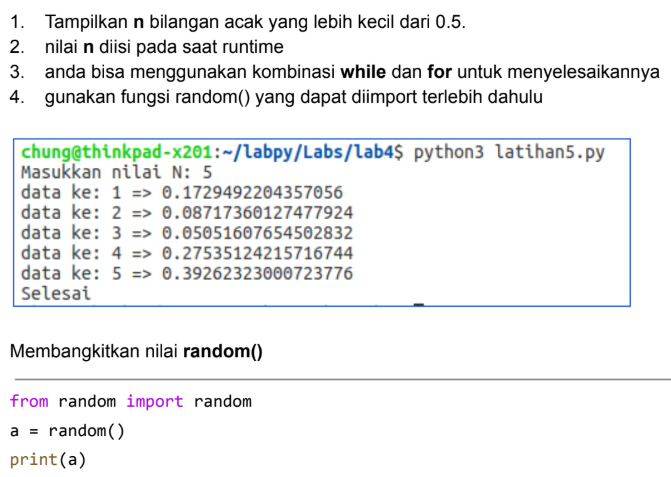
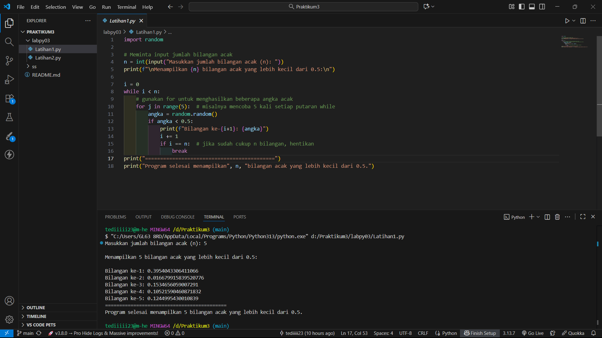
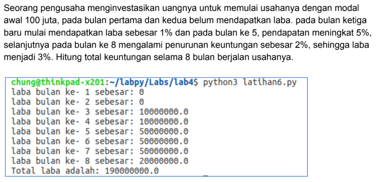
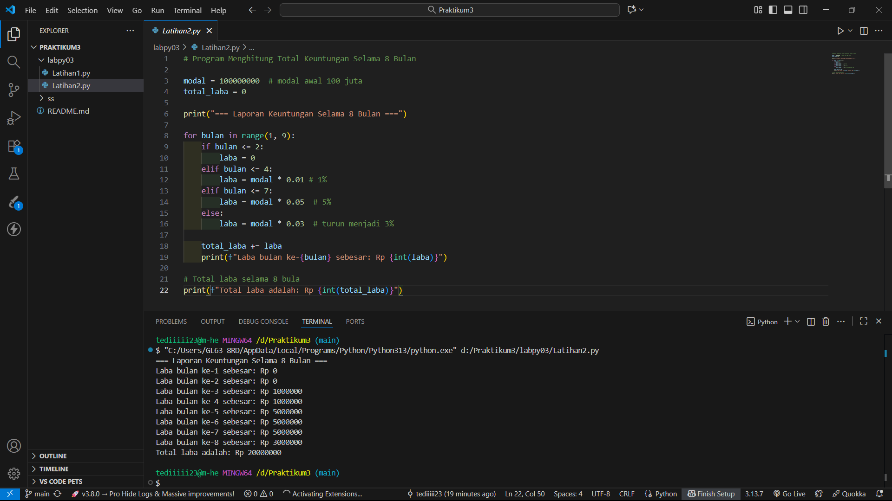

# Praktikum3 (labpy3)  

|  |  |
| -------- | --- |
| **Nama** | Tedi Mulyadi |
| **NIM** | 312510163 |
| **Kelas** | TI.25.A2 |
| **Mata Kuliah** | Pengantar Pemrograman |
| **Dosen** | Agung Nugroho, S.Kom., M.Kom. |  

---

## Latihan 1 : Latihan.py

---  
 

## Kode Program

 ```Python
import random

# Meminta input jumlah bilangan acak
n = int(input("Masukkan jumlah bilangan acak (n): "))

print(f"\nMenampilkan {n} bilangan acak yang lebih kecil dari 0.5:\n")

i = 0
while i < n:
    # gunakan for untuk menghasilkan beberapa angka acak
    for j in range(5):  # misalnya mencoba 5 kali setiap putaran while
        angka = random.random()
        if angka < 0.5:
            print(f"Bilangan ke-{i+1}: {angka}")
            i += 1
            if i == n:  # jika sudah cukup n bilangan, hentikan
                break
```  

### Output program
  

## Penjelasannya  

```python
import random
```
---  

Digunakan untuk memanggil library `random` yang digunakan untuk membuat angka acak. fungsi yang digunakan adalah `random.random()` , yang menghasilkan angka antara 0.0 sampai 1.0  

---  

### Input Jumlah Bilangan Acak
```python
n = int(input("Masukkan jumlah bilangan acak (n): "))
```
Program meminta pengguna memasukkan berapa banyak bilangan acak (`n`) yang ingin dibuat.  
Nilainya diubah ke **integer (int)** agar bisa digunakan dalam perulangan.

Contoh input:
```
Masukkan jumlah bilangan acak (n): 5
```

---

### Menampilkan Judul Output
```python
print(f"\nMenampilkan {n} bilangan acak yang lebih kecil dari 0.5:\n")
```
Menampilkan teks agar hasil output terlihat lebih rapi dan mudah dibaca.

---

### Perulangan Utama (while)
```python
i = 0
while i < n:
```
- `i` digunakan untuk menghitung berapa banyak bilangan acak yang sudah ditampilkan.
- Perulangan `while` akan berjalan selama `i` masih kurang dari `n`.

---

### Perulangan `for` di Dalam `while`
```python
for j in range(5):
```
Setiap putaran `while`, program mencoba menghasilkan **5 angka acak**.  
Tujuannya agar pencarian angka acak yang < 0.5 lebih cepat.

---

### Menghasilkan dan Mengecek Angka Acak
```python
angka = random.random()
if angka < 0.5:
    print(f"Bilangan ke-{i+1}: {angka}")
    i += 1
```
- `random.random()` menghasilkan angka acak antara 0.0 sampai 1.0.  
- Jika angka tersebut **kurang dari 0.5**, maka akan dicetak di layar.  
- Setiap kali mencetak bilangan, nilai `i` bertambah 1.

---

### Menghentikan Program Setelah Cukup
```python
if i == n:
    break
```
Jika jumlah bilangan yang dicetak sudah sama dengan jumlah yang diminta (`n`), maka program berhenti.

---

---

## Kesimpulan

| Komponen | Fungsi |
|-----------|---------|
| `random.random()` | Menghasilkan bilangan acak antara 0.0 – 1.0 |
| `if angka < 0.5:` | Menyeleksi hanya angka di bawah 0.5 |
| `while i < n:` | Mengontrol jumlah bilangan yang dicetak |
| `for j in range(5):` | Mencoba menghasilkan beberapa angka setiap iterasi |
| `break` | Menghentikan proses setelah mencapai jumlah bilangan yang diminta |

---

## Latihan 2 : Latihan.py

 

## Kode Program  

```Python
# Program Menghitung Total Keuntungan Selama 8 Bulan

modal = 100000000  # modal awal 100 juta
total_laba = 0

print("=== Laporan Keuntungan Selama 8 Bulan ===")

for bulan in range(1, 9):
    if bulan <= 2:
        laba = 0
    elif bulan <= 4:
        laba = modal * 0.01 # 1%
    elif bulan <= 7:
        laba = modal * 0.05  # 5%
    else: 
        laba = modal * 0.03  # turun menjadi 3%

    total_laba += laba
    print(f"Laba bulan ke-{bulan} sebesar: Rp {int(laba)}")

# Total laba selama 8 bula
print(f"Total laba adalah: Rp {int(total_laba)}")
```  

#### Output program 
  

---

## Hasil Akhir  
---

Setelah 8 bulan menjalankan usahanya, pengusaha memperoleh **total keuntungan sebesar Rp20.000.000**.  

---

---

## Penjelasan Singkat
- Program menggunakan **perulangan `for`** dari bulan ke-1 hingga bulan ke-8.
- Menggunakan **struktur percabangan `if`** untuk menentukan laba berdasarkan bulan.
- Nilai laba setiap bulan dijumlahkan ke dalam variabel `total_laba`.
- Di akhir program, ditampilkan total laba yang diperoleh selama 8 bulan.

---
